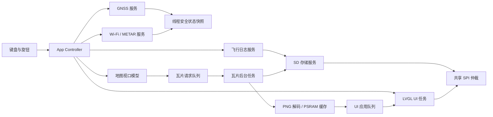

# FlightMate（飞行伴侣）可行性分析与完整实施设计方案

版本：设计基线 v1.0  
日期：2026-07-24

## 1. 结论

FlightMate 在 LilyGo T-LoRa Pager V1.0 上整体可行，且具备较好的落地基础。设备已有 ESP32-S3、16 MB Flash、8 MB PSRAM、MIA-M10Q GNSS、PCF85063A RTC、BQ27220 电量计、TCA8418 键盘、旋钮、ST7796U 480×222 屏幕和最大 32 GB FAT32 SD 卡，能够覆盖计划中的定位、离线地图、联网机场气象、飞行日志、设置和低功耗需求。

建议不要直接在原 FlightRadar 的单个 `.ino` 文件上继续堆功能，也不要直接复制 Trail-Mate 的 AGPL-3.0 地图代码。最稳妥路线是：

1. 复用旧 FlightRadar 已在 T-Pager 上验证过的 Arduino-ESP32 + LilyGoLib 板级基线。
2. 把应用重组为模块化 C++/LVGL 工程。
3. 独立实现一套简化的 XYZ/PNG 离线地图流水线，借鉴 Trail-Mate 的分层和异步思想。
4. 第一版只支持一种地图源、1～9 级、无在线下载和无复杂轨迹编辑，以控制范围和资源风险。

本产品应明确定位为乘客侧飞行记录和态势展示工具，不是航空导航设备，也不能用于飞行安全、航班运行或空中交通决策。

## 2. 已核对的事实与假设

### 2.1 已确认硬件事实

| 项目 | 事实 | 对设计的影响 |
| --- | --- | --- |
| MCU | ESP32-S3 | 双核与 PSRAM 可承担 UI、GNSS、网络及地图后台任务 |
| 存储 | 16 MB QSPI Flash、8 MB QSPI PSRAM | 固件和运行缓存充足；地图与日志必须放 SD 卡 |
| 屏幕 | ST7796U，480×222，SPI，RGB565 | 适合横屏仪表风格；不适合高密度长表单同屏展示 |
| GNSS | u-blox MIA-M10Q，UART TX=GPIO12、RX=GPIO4、PPS=GPIO13 | 可提供位置、地速、航向、海拔和 UTC 时间 |
| SD 卡 | CS=GPIO21，共用 SPI，最大 32 GB、FAT32 | 地图读盘与屏幕刷新必须共享总线并仲裁 |
| 键盘 | TCA8418，I2C 0x34，IRQ=GPIO6 | 适合快捷键和字母数字录入 |
| 键盘背光 | GPIO46 | 可实现三档背光，但需实机确认 PWM 或离散输出效果 |
| RTC | PCF85063A，I2C 0x51 | 可在断网、无 GNSS 时维持时间基准 |
| 电量计 | BQ27220，I2C 0x55 | 可显示电量百分比 |
| 电源控制 | GNSS 与 SD 由 XL9555 控制供电 | 可按功能启停外设以降低功耗 |

SPI MOSI/MISO/SCK 为 GPIO34/33/35，屏幕、SD、LoRa、NFC 共享该总线。FlightMate 第一版不初始化 LoRa 和 NFC，但仍必须使用统一的 SPI 互斥，不能让 SD 读取与屏幕刷新并发占用总线。实际开发前还必须确认设备的射频板型选项；即使本版不启用 LoRa，也应选择与实物一致的 Board Revision。键盘、SD 等 XL9555 供电通道统一调用 LilyGoLib API，不在应用中硬编码扩展 IO 位号。

### 2.2 已有 FlightRadar 的可复用能力

旧 FlightRadar 本地源码和交付资料证明以下路径已有可用基础：

- T-Pager 显示、PSRAM 全屏画布、键盘原始事件、Wi-Fi 扫描和密码录入；
- NVS 配置持久化、四档屏幕亮度、电量读取；
- NTP 时间、附近机场查询、METAR 获取；
- 深睡“关机”和黄色键唤醒；
- Arduino-ESP32 3.3.10、LilyGoLib 0.2.0、ArduinoJson 7.4.2 的既有构建链。

其中 FlightRadar 主界面和 OpenSky 数据曾由用户实机确认可工作；后加的机场/METAR、电量及最终布局仍属于需继续实机复核的能力。旧代码采用单个约 60 KB `.ino`、明文配置和 `setInsecure()`，只应提取板级经验，不应作为 FlightMate 的最终架构。

### 2.3 当前设计假设

- 目标设备为 T-LoRa Pager V1.0；第一版不使用 LoRa、NFC、音频和 BHI260。
- 第一版不做 OTA，采用 USB 完整镜像升级；待 App 大小稳定后再决定是否改双 OTA 分区。
- 飞行日志使用英文/数字结构化字段；如需中文自由文本，应另立中文输入法需求，不纳入 MVP。
- 地图瓦片由电脑预先下载、裁剪并复制到 SD 卡；设备不在线下载瓦片。
- 地图采用 WGS-84 Web Mercator 标准 XYZ；GPS 坐标不转 GCJ-02/BD-09。
- 机场自动匹配由设备本地机场数据库完成，不依赖 Overpass 实时查询。

## 3. 可行性分项评估

| 功能 | 可行性 | 难度 | 关键说明 |
| --- | --- | --- | --- |
| 本地/UTC/日期 | 高 | 低 | GNSS、NTP、RTC 三种时间源可融合 |
| 最近机场匹配 | 高 | 中 | 推荐本地二进制机场索引，离线可用且响应稳定 |
| METAR | 高 | 中 | Aviation Weather Center 原始 METAR 接口可沿用；需缓存和限流 |
| 离线瓦片地图 | 高 | 高 | 最大风险是共享 SPI、PNG 解码、PSRAM 缓存和 UI 卡顿 |
| GNSS 实时参数 | 高 | 中 | MIA-M10Q 能直接提供计划字段；需定义单位和无效值规则 |
| 地图平移/缩放 | 高 | 中 | 1～9 级和键盘操作比触摸手势简单，适合本设备 |
| 飞行日志 | 高 | 中高 | 字段多，主要难点是小屏表单交互、原子保存和版本迁移 |
| Wi-Fi 设置 | 高 | 中 | 可复用旧实现；密码应遮罩并避免日志输出 |
| 自动熄屏/亮度 | 高 | 低中 | 屏幕休眠与系统睡眠要区分 |
| 键盘背光三档 | 高 | 低中 | GPIO46 控制，亮度档位需实机标定 |
| 整机关机 | 高 | 中 | 软件关机用深睡；硬件 PWR 完全断电不可由程序触发 |

## 4. 产品范围与版本边界

### 4.1 MVP 必须包含

- 首页、机场、飞行、日志、设置五个面板；
- GNSS 开关、有效定位状态、速度/航向/高度/经纬度；
- SD 卡离线 OSM 风格瓦片，缩放 1～9、WASD 平移、Q/E 缩放、C 回中；
- 本地机场数据库最近机场匹配；
- 联网获取 METAR，缓存后离线查看；
- 飞行日志新建、浏览、编辑、按日期排序；
- Wi-Fi、时区、亮度、熄屏、手动坐标、GPS 开关；
- 电量、屏幕亮度快捷键、键盘背光快捷键、深睡关机。

### 4.2 MVP 明确不包含

- 在线地图下载、设备端瓦片管理器和全世界瓦片包；
- 航班号自动反查航空公司/机型/注册号；
- 轨迹回放、航线规划、导航指令或地形告警；
- LoRa、ADS-B 无线接收、OpenSky 实时飞机雷达；
- 云同步、账号系统、OTA、中文自由文本输入；
- 将 GPS 海拔宣称为精确气压高度或座舱高度。

## 5. 推荐技术基线

### 5.1 框架选择

推荐第一版采用：

- Arduino-ESP32 3.3.10；
- 官方 LilyGoLib 0.2.0 及其锁定依赖；
- LVGL 9.x（固定具体版本，禁止开发中随意升级）；
- ArduinoJson 7.4.2；
- TinyGPSPlus 或 LilyGoLib 已封装的 GPS 接口；
- FAT32 SD；NVS/Preferences 存储配置。

理由：FlightRadar 已用这套板级链路成功构建并在实机运行，GPS、SD、键盘、RTC、电量和电源控制也都由 LilyGoLib 提供。与重新做纯 ESP-IDF 板级驱动相比，这条路线工作量更小、硬件风险更低。应用代码仍使用 FreeRTOS 任务、队列、互斥和事件组，保持模块化。

### 5.2 目录结构

```text
FlightMate/
├─ FlightMate.ino                 # 只负责启动与主循环入口
├─ app/
│  ├─ app_controller.*            # 页面状态机与全局事件
│  ├─ app_events.*
│  └─ app_model.*
├─ board/
│  └─ tpager_board.*              # LilyGoLib 适配、供电、总线、按键
├─ services/
│  ├─ gps_service.*
│  ├─ time_service.*
│  ├─ wifi_service.*
│  ├─ weather_service.*
│  ├─ airport_service.*
│  ├─ storage_service.*
│  ├─ settings_service.*
│  └─ power_service.*
├─ map/
│  ├─ map_projection.*
│  ├─ map_tile_source.*
│  ├─ map_tile_worker.*
│  ├─ map_tile_cache.*
│  └─ map_view_model.*
├─ flightlog/
│  ├─ flight_log_model.*
│  ├─ flight_log_store.*
│  └─ flight_log_validation.*
├─ ui/
│  ├─ ui_theme.*
│  ├─ ui_shell.*
│  ├─ pages/
│  └─ widgets/
└─ assets/
```

每个模块只暴露小型接口；禁止跨页面直接访问硬件对象，禁止在 LVGL 回调中做网络、SD 读写或 JSON 解析。

## 6. 系统架构



### 6.1 任务与并发模型

| 执行域 | 建议周期/触发 | 职责 | 禁止事项 |
| --- | --- | --- | --- |
| UI/LVGL | 5～10 ms pump | 创建控件、应用模型、处理按键动作 | 网络、长时间 SD I/O、PNG 解码 |
| GNSS | UART 持续接收，5～10 Hz 解析 | 更新定位快照、统计距离/时长 | 直接操作 LVGL |
| 网络 | 事件驱动 | Wi-Fi、NTP、METAR HTTP | 持有 SPI 锁、直接改 UI |
| 地图瓦片 | 请求队列 | SD 读、PNG 解码、缓存 | 在拖动时阻塞 UI |
| 存储 | 串行化请求 | 日志与缓存原子写入 | 多任务同时写 FATFS |

共享状态采用“服务内部拥有状态，外部读取快照”的模式。LVGL 只允许 UI 任务调用；SD 和屏幕共享 SPI，所有传输统一经过同一互斥锁。

## 7. 离线地图完整设计

### 7.1 瓦片规范

- 坐标：WGS-84 输入，Web Mercator 投影；
- 编号：标准 XYZ；
- 尺寸：256×256；
- 格式：8 位调色板 PNG 或经过优化的 RGB PNG；
- 缩放：1～9；
- 第一版仅一个 `osm` 基础图层；
- 目录：

```text
/FlightMate/maps/base/osm/{z}/{x}/{y}.png
```

该路径与 Trail-Mate 的基础瓦片思路保持一致，但 FlightMate 代码独立实现。建议在 SD 根目录放 `manifest.json`：

```json
{
  "schema": 1,
  "name": "FlightMate OSM China-East",
  "tileSize": 256,
  "format": "png",
  "scheme": "xyz",
  "minZoom": 1,
  "maxZoom": 9,
  "bounds": [100.0, 15.0, 125.0, 45.0],
  "attribution": "© OpenStreetMap contributors"
}
```

程序启动时只验证 manifest、目录和当前中心瓦片，不扫描整个瓦片树。

### 7.2 投影和视口

使用标准公式：

```text
n = 2^z
xTile = floor((lon + 180) / 360 * n)
yTile = floor((1 - ln(tan(lat) + sec(lat)) / π) / 2 * n)
```

纬度限制为 ±85.05112878°；X 环绕，Y 截断。内部维护：

- `focusLat/focusLon`：GPS 位置；
- `panX/panY`：相对焦点的世界像素偏移；
- `zoom`：1～9；
- `followMode`：是否保持自身居中；
- `generation`：每次缩放、跨瓦片平移或地图源变化递增。

按键行为：

- Q：放大一级，最大 9；
- E：缩小一级，最小 5；
- W/A/S/D：每次平移 64 像素，长按可 150 ms 连发；
- C：`panX=0`、`panY=0`、恢复跟随；
- GPS 更新时，只有 `followMode=true` 才改变地图中心。

### 7.3 加载和取消策略

480×222 视口正常会覆盖 2～6 张瓦片。可见瓦片按“距离屏幕中心最近”排序，最多维护 12 个瓦片记录。

1. UI 根据当前视口生成瓦片计划。
2. 查解码缓存；命中则立即绑定图片。
3. 未命中则进入容量 12 的请求队列，并携带当前 generation。
4. 后台任务检查文件、分块读取 PNG、释放共享 SPI 让屏幕刷新。
5. PNG 解码到 PSRAM 中的 RGB565 图像。
6. 结果进入 UI 事件队列；UI 每次最多应用 1 张，避免掉帧。
7. 结果 generation 不是当前值时立即丢弃。

SD 大文件读取建议每 2 KB 暂时释放 SPI 锁并 `vTaskDelay(1)`，与 Trail-Mate 已验证的共享总线治理思想一致。

### 7.4 缓存和内存预算

单张 256×256 RGB565 解码图约 128 KiB。建议：

| 项目 | 数量/大小 | 估算 |
| --- | --- | --- |
| 解码瓦片 LRU | 8 张 | 1.0 MiB |
| PNG 读取 scratch | 192 KiB | 192 KiB |
| LVGL 双绘制缓冲 | 2 × 480×20×2 | 38 KiB，必须 DMA 内存 |
| UI 对象、字体、模型 | 视字体而定 | 0.5～1.5 MiB PSRAM/Flash |
| 网络/JSON | 按需分配 | 重点监控内部 RAM |

缓存条目只有在不被 LVGL 图片对象引用时才能淘汰。缺失瓦片坐标缓存 5 分钟，避免反复 `exists/open`。进入其他页面时默认释放地图解码缓存；若实测余量足够，再保留最近 4 张。

### 7.5 地图异常体验

- 无 SD：显示“未检测到 SD 卡”，数据栏仍显示 GNSS；
- manifest 不匹配：显示“地图包格式不兼容”；
- 局部瓦片缺失：使用深色网格占位并显示当前 z/x/y；
- PNG 解码失败：记录一次限频日志，不持续重试；
- GPS 无定位：允许用上次位置或手动坐标浏览，但飞机图标显示为空心/灰色；
- 不允许在飞行过程中联网补瓦片。

### 7.6 地图资源与许可

OpenStreetMap 数据必须保留 `© OpenStreetMap contributors` 署名；公共 OSM 瓦片服务器通常不允许批量离线下载。应提供 PC 端地图包制作脚本，由使用者选择允许离线使用的瓦片源，或使用自建/合规供应商。仓库中不要提交大体积瓦片。

Trail-Mate 为 AGPL-3.0。若 FlightMate 希望使用 MIT/闭源或其他非 AGPL 许可，只能借鉴公开思想、接口分层和标准算法，不得复制或改写其具体实现代码。若直接复用代码，则整个衍生作品需按 AGPL 义务处理。

## 8. 机场面板设计

### 8.1 页面布局

```text
┌ FlightMate / AIRPORT ─ ZBAA ─ GPS ● ─ WiFi ● ─ BAT 82% ┐
│ LOCAL 14:36:21      UTC 06:36:21      2026-07-24       │
│ Beijing Capital / 18.4 km / BRG 032°                   │
│ METAR ZBAA 240600Z 02003MPS 9999 ...                   │
│ Updated 14:31  |  Cache valid  |  R Refresh  |  Q Back │
└─────────────────────────────────────────────────────────┘
```

建议把 ICAO、时间和原始 METAR 作为核心，不在 MVP 解析云底、能见度等结构化天气卡片。

### 8.2 最近机场数据库

不建议继续使用 FlightRadar 中的 Overpass 在线查找作为主路径，因为它慢、易限流、断网不可用。改用 PC 端构建并随固件烧录的本地只读数据库：

```text
assets/airports.bin  →  构建时嵌入固件只读数据区
```

每条记录仅保存 ICAO、纬度、经度、名称偏移和机场类型，按纬度分桶或使用固定网格索引。运行时先筛选周边网格，再用 Haversine 距离选最近机场。推荐只收录有 ICAO 的中大型机场和地区机场，数据规模可控制在几百 KiB。

自动匹配规则：

- 定位精度有效且移动超过 20 km，或距上次查询超过 30 分钟时重算；
- 手动坐标优先级低于有效 GPS；
- 如果 150 km 内没有机场，显示 `----`；
- 数据库无有效匹配时保持 `----`，不猜测或伪造机场代码。

### 8.3 时间源融合

优先级：

1. 有效 GNSS UTC；
2. 成功的 NTP；
3. RTC；
4. 编译时间，仅用于首次启动提示。

得到 GNSS/NTP 后校准 RTC。内部统一保存 UTC epoch，本地时间只在显示时应用 POSIX TZ。设置页不应只存“UTC+8”数字，应保存类似 `CST-8` 的时区字符串；MVP 可提供常用列表和自定义 UTC 偏移。

### 8.4 METAR 数据源与缓存

沿用 Aviation Weather Center：

```text
GET https://aviationweather.gov/api/data/metar?format=raw&taf=false&hours=2&ids=ZBAA
```

缓存保存在内部 NVS 的 `weather-cache` 命名空间，不依赖 SD 卡：

```text
metar_icao / metar_raw / fetched_utc / source
```

字段：`schema`、`icao`、`raw`、`fetchedUtc`、`source`。策略：

- 页面进入时：缓存超过 30 分钟且 Wi-Fi 可用则刷新；
- 后台自动：至少 30 分钟一次，仅在设备未处于文字编辑和飞行地图高负载状态时执行；
- 手动刷新：最短间隔 60 秒；
- 失败后指数退避 1/2/5/10/30 分钟；
- 断网显示缓存及“更新于”时间，不伪装为实时。

生产版本必须验证 TLS 证书链或固定可信 CA，不使用 `setInsecure()`。

## 9. 飞行面板与 GNSS 设计

### 9.1 页面布局

```text
┌──────────── 地图 340×190 ────────────┬──── 数据 140×190 ────┐
│                                      │ SPD   842 km/h        │
│           离线地图 + 飞机图标        │ TRK   074°            │
│                                      │ ALT   10,668 m        │
│                                      │ LAT   39.123456        │
│                                      │ LON  116.123456        │
├──────────────────────────────────────┴───────────────────────┤
│ Z7 FOLLOW | Q/E ZOOM | WASD PAN | C CENTER | GPS 3D 14 SAT  │
└──────────────────────────────────────────────────────────────┘
```

### 9.2 GNSS 状态机

```text
OFF → POWERING → SEARCHING → FIX_2D/FIX_3D → DEGRADED → ERROR
```

- `OFF`：关闭 GNSS 电源，UART 停止；
- `POWERING`：打开 XL9555 GNSS 供电并初始化 UART；
- `SEARCHING`：持续解析但无有效定位；
- `FIX_2D/3D`：位置有效；
- `DEGRADED`：超过 3 秒无新定位，保留最后值但标黄；
- `ERROR`：超过 120 秒无有效串口数据或初始化失败。

进入飞行面板时若 GPS 总开关关闭，弹窗提供“开启 GPS”和“取消”。开启后任务持续运行，离开页面不自动关闭，以满足后台保持连接；只有用户关闭总开关或进入深睡才断电。

### 9.3 字段、单位和有效性

| 显示 | 数据源 | 单位 | 无效处理 |
| --- | --- | --- | --- |
| 速度 | GNSS ground speed | km/h，可设置 kt | 显示 `---` |
| 航向 | GNSS course over ground | 0～359° | 速度 < 5 km/h 时显示灰色 |
| 高度 | GNSS altitude MSL | m，可设置 ft | 标注 `GPS ALT` |
| 经纬度 | GNSS WGS-84 | 十进制度 6 位 | 显示最后值并标记 stale |
| 卫星/HDOP | GNSS | 数量/无量纲 | 顶栏状态使用 |

### 9.4 可选增强：自动飞行统计

日志中的飞行距离、时长、巡航速度在 MVP 中均可手动录入。若后续确认需要自动统计，可增加内部 `FlightSession`，但它不作为第一版验收条件：

- 由飞行面板中的明确“开始/停止记录”动作控制，不占用现有快捷键；
- 仅在定位有效、速度 ≥ 20 km/h、相邻点间隔 0.5～10 秒时累加 Haversine 距离；
- 过滤单点跳变：速度推算 > 1,400 km/h 或 HDOP 过差的点不计；
- 每 30 秒写一次轻量 checkpoint，结束后生成统计摘要；
- 自动填充日志的距离、持续时间、最高/平均速度和最高 GNSS 高度，用户可修改。

原始轨迹同样不属于 MVP。如需保留，可用紧凑二进制或 GPX 单独开关，避免持续写放大。

## 10. 飞行日志设计

### 10.1 SD 目录和文件名

```text
/FlightLog/
  20260724-083000-CA1234.json
/FlightLog/index.bin
/FlightLog/.tmp/
```

保留计划中的 `FlightLog` 目录名，插入新卡后进入日志面板即自动创建。航班号清洗为 `A-Z0-9-_`；未知航班号使用 `UNKNOWN`。

### 10.2 JSON 数据模型

```json
{
  "schema": 1,
  "id": "20260724-083000-CA1234",
  "createdUtc": 1784853000,
  "updatedUtc": 1784856600,
  "flight": {
    "date": "2026-07-24",
    "flightNo": "CA1234",
    "departureIcao": "ZBAA",
    "arrivalIcao": "ZSSS",
    "departureLocal": "08:30",
    "arrivalLocal": "10:42"
  },
  "aircraft": {
    "airline": "Air China",
    "type": "A321",
    "registration": "B-0000",
    "engine": "",
    "ageYears": null
  },
  "seat": {
    "cabin": "ECONOMY",
    "seatNo": "18A"
  },
  "operations": {
    "departureRunway": "36R",
    "arrivalRunway": "18L",
    "gate": "C23",
    "standType": "JET_BRIDGE",
    "pushbackLocal": "08:21",
    "takeoffLocal": "08:42",
    "landingLocal": "10:31",
    "onBlockLocal": "10:40"
  },
  "metrics": {
    "cruiseAltitudeM": 10668,
    "durationSec": 7140,
    "distanceKm": 1085.3,
    "cruiseSpeedKmh": 842.0
  },
  "experience": {
    "mealRating": 4,
    "serviceRating": 5,
    "notes": ""
  }
}
```

时间字段必须明确是本地时间还是 UTC；只有一个“起飞/到达当地时间”不够，需要分别绑定起点和终点时区，MVP 可以只存原始本地字符串并由用户输入。

### 10.3 原子保存

1. 写入 `/FlightLog/.tmp/<id>.json.tmp`；
2. `flush()`、关闭；
3. 重新打开做最小 JSON 校验；
4. 将旧文件重命名为 `.bak`；
5. 将 `.tmp` 重命名为正式文件；
6. 成功后删除 `.bak`；
7. 更新 `index.bin`。

启动或进入日志页时清理残留 `.tmp`，遇到正式文件损坏可提示从 `.bak` 恢复。写入期间禁止拔卡提示无法完全保证，但该流程能显著降低损坏概率。

### 10.4 表单交互

字段多，不应做一个超长滚动页。新建/编辑采用六步向导：

1. 航班；
2. 航空器；
3. 座位；
4. 运行时间；
5. 飞行指标；
6. 体验与保存。

每页 4～6 个字段，旋钮/W/S 选择，Enter 编辑，Q 返回，E 在只读详情页进入编辑。修改后退出必须弹出“保存/放弃/继续编辑”。下拉枚举用于舱位、机位类型和评分；文本编辑器复用 Wi-Fi 输入组件。

历史列表只读 `index.bin`，显示日期、航班号、起降机场。索引丢失时允许后台从 JSON 重建；排序键使用 `flight.date + departureLocal`，无值则回退 `createdUtc`。

## 11. 设置、快捷键和全局交互

### 11.1 设置结构

| 分组 | 项目 |
| --- | --- |
| 网络 | Wi-Fi 扫描、SSID、密码、连接状态 |
| 时间 | 时区、RTC 状态、立即同步 |
| 显示 | 屏幕亮度、熄屏时间、键盘背光 |
| 定位 | GPS 总开关、手动经纬度、GNSS 状态 |
| 存储 | SD 状态、容量、地图包、日志数量 |
| 系统 | 关于、版本、诊断、关机 |

配置保存在 NVS，增加 `settings_schema` 版本。Wi-Fi 密码默认遮罩；串口日志只显示 SSID，不显示密码、METAR 请求凭据或其他秘密。

### 11.2 输入优先级

为避免计划中 `E` 同时是地图缩小和日志编辑造成混乱，采用页面作用域按键：

- 飞行地图：Q/E 缩放；
- 日志详情：E 编辑；
- 文本编辑：Q/E 输入普通字符，不触发全局快捷键；
- 返回键：只在非文本输入、非确认弹窗时返回首页；
- L：仅机场和飞行面板调屏幕亮度；
- B：所有页面非输入状态调键盘背光。

所有页面底部显示当前可用快捷键，降低记忆成本。

### 11.3 熄屏和关机

- 熄屏：只关闭 ST7796 显示与背光，应用/GNSS 可继续；任意键或旋钮唤醒屏幕；
- 软件关机：停止网络与存储任务、完成文件 flush、关闭 GNSS/SD 等外设、屏幕 sleep 后进入 deep sleep；
- 唤醒：优先使用官方 PWR/BOOT；如继续采用黄色键 GPIO6 唤醒，必须保留键盘供电，并披露约 530 µA 量级深睡而非 26 µA 硬关机；
- USB 连接时官方硬件完全关机存在限制，UI 应明确显示“已进入低功耗待机”。

## 12. UI 视觉规范

可以继承 FlightRadar 的黑底、航空绿、雷达网格和高对比技术仪表感，但不要把所有页面都做成密集终端界面。

### 12.1 设计令牌

| Token | 建议值 | 用途 |
| --- | --- | --- |
| Background | `#07100D` | 主背景 |
| Panel | `#0D1A16` | 卡片/侧栏 |
| Primary | `#39E58C` | 正常、焦点、主数据 |
| Accent | `#55C7FF` | GPS/可操作元素 |
| Warning | `#FFB547` | 缓存陈旧、定位退化 |
| Danger | `#FF5D6C` | 错误、无 SD、保存失败 |
| Text | `#E9FFF5` | 主文字 |
| Muted | `#78998B` | 次文字 |

字体建议仅内置必要字形的中英文字库：12/16/20 px 三档，数字可用等宽字体。全屏不使用透明阴影和大面积渐变，以减轻软件渲染压力。

### 12.2 页面骨架

所有页面使用相同结构：

```text
顶部 24 px：页面名 / ICAO或状态 / GPS / Wi-Fi / SD / 电量
中部 174 px：页面内容
底部 24 px：快捷键提示 / 更新时间 / 错误提示
```

首页建议四个 96×70 左右功能卡片加一个状态栏，旋钮移动焦点、按压进入。地图页允许内容占满中部；日志表单保持行高至少 28 px。

UI 效果图应在编码前交付：主页、机场、飞行地图、日志列表、日志详情、日志编辑、设置、通用弹窗八张 480×222 图，并给出正常/无 GPS/无 SD/离线缓存四类状态变体。

## 13. 数据、安全和可靠性

### 13.1 网络可靠性

- HTTP 请求设连接、响应和总时限；
- 只允许一个天气请求并发；
- 不在每 30 分钟点强制唤醒 Wi-Fi，采用“到期后在系统空闲窗口刷新”；
- Wi-Fi 失败不阻塞主界面和飞行功能；
- 所有在线数据显示来源和时间戳。

### 13.2 凭据和 TLS

- Wi-Fi 密码保存于 NVS；如果产品需要更强安全性，再启用 NVS 加密和 Flash Encryption；
- 禁止在 UI、日志或故障报告中打印密码；
- HTTPS 使用系统 CA 或嵌入目标 CA；
- 不沿用 FlightRadar 的 `setInsecure()`；
- 第一版不需要 OpenSky 凭据，因为 FlightMate 不拉实时飞机数据。

### 13.3 SD 健壮性

- 只支持 FAT32，插卡后验证可读写；
- 统一串行写服务，地图任务只读；
- 检测拔卡后立即取消地图 generation 和待写请求；
- 日志保存显示明确成功/失败，不只依赖无异常返回；
- 记录 `last_error`、剩余容量和最近成功写入时间供诊断页显示。

### 13.4 观测性

串口 115200，稳定标签：`APP/UI/GPS/MAP/SD/NET/WEATHER/LOG/POWER`。日志包含状态转换、耗时、错误码、重试和堆内存最低值。开发版建议提供 USB 诊断命令：

```text
status
gps
sd
map z x y
heap
tasks
weather refresh
log level <tag> <level>
```

## 14. 分区与存储策略

第一版建议暂不 OTA，16 MB Flash 仅存固件、NVS、机场只读数据库、崩溃信息和少量内部数据；日志和地图放 SD，METAR 缓存放 NVS。不要沿用 Arduino 默认约 9.9 MB FATFS 而同时把主要数据又放 SD，造成大量无用途分区。

在实际 App 首次完整构建后再定分区表。目标原则：

- App 分区至少为当前二进制的 1.5 倍；
- NVS 128～256 KiB；
- 可选 coredump 256～512 KiB；
- 剩余空间可作为 LittleFS 恢复配置/机场迷你库备份，或明确保留增长；
- 如决定 OTA，则改为 `otadata + ota_0 + ota_1`，每槽需覆盖完整 App 与增长空间。

## 15. 开发分期、成功标准和工期估算

以下为单人、已有硬件、能持续实机测试条件下的工程估算，不含地图数据授权采购和大量 UI 返工。

### 阶段 0：工程基线（2～3 天）

交付：模块化工程骨架、固定依赖、板级初始化、构建脚本、串口日志。  
验收：连续冷启动 20 次；屏幕、键盘、旋钮、SD、GNSS、RTC、电量均输出明确探测结果；完整构建无错误。

### 阶段 1：UI Shell 与设置（4～6 天）

交付：首页、主题、通用顶部/底部栏、Wi-Fi/时区/亮度/熄屏/GPS设置、输入组件。  
验收：所有页面进退 200 次无崩溃；配置重启后保存；密码遮罩；快捷键不在文本编辑状态误触。

### 阶段 2：GNSS 与飞行面板（4～6 天）

交付：GNSS 状态机、实时参数、后台保持。  
验收：冷启动搜星、室外移动测试；断开/恢复天线或供电后状态正确；无 fix 不显示伪数据。

### 阶段 3：离线地图（7～10 天）

交付：PC 瓦片包工具、manifest、XYZ 投影、异步读取/解码、缓存、平移缩放。  
验收：1～9 级连续操作 30 分钟无看门狗/崩溃；地图键响应 <100 ms；正常瓦片首次显示目标 <500 ms；共享 SPI 下无持续花屏；缺瓦片和拔卡可恢复。

### 阶段 4：机场与 METAR（3～5 天）

交付：机场数据库生成器、本地最近机场、时间源融合、METAR 缓存。  
验收：至少 30 个测试坐标匹配结果与 PC 基准一致；联网、断网、缓存陈旧、API 错误均显示正确；30 分钟自动刷新不干扰地图。

### 阶段 5：飞行日志（6～8 天）

交付：日志向导、列表/详情/编辑、原子保存、索引重建。  
验收：100 条日志排序正确；保存中模拟复位后不丢失上一个有效版本；非法字段被阻止；拔卡时给出失败而不假成功。

### 阶段 6：电源、稳定性与交付（5～8 天）

交付：熄屏、深睡、键盘背光、功耗调优、完整镜像、烧录包、SHA-256、用户说明。  
验收：8 小时持续运行；100 次页面切换和 20 次睡眠唤醒；测量活动/熄屏/深睡电流；构建、镜像和实机验证分别记录。

总计约 31～46 个工程日。若先做一个真正可用的核心 MVP（设置、GNSS、单图层地图、机场/METAR、简化日志），可压缩到约 20～28 个工程日。

## 16. 测试矩阵

| 类别 | 必测场景 |
| --- | --- |
| 启动 | 无 SD、坏 SD、无电池、USB 供电、RTC 无效、NVS 首次启动 |
| GNSS | 冷启动、热启动、无卫星、2D/3D、数据中断、关闭/重新开启 |
| 地图 | z1/z9 边界、经度 ±180、纬度极限、连续平移、缺瓦片、坏 PNG、拔卡 |
| SPI | 地图加载同时全屏刷新、日志写入同时 UI 刷新、SD 慢卡 |
| 网络 | 错密码、无 DNS、HTTPS 失败、API 404/429/500、断网缓存 |
| 时间 | GNSS→RTC、NTP→RTC、跨日、负时区、半小时时区 |
| 日志 | 空字段、超长字段、100/1000 条、保存中断电、索引损坏 |
| 电源 | 30/60 秒熄屏、常亮、深睡、黄色键/电源键唤醒、USB 插入 |
| 内存 | 页面循环、瓦片缓存淘汰、网络 JSON 峰值、最低内部堆和 PSRAM |

地图算法、机场距离、文件名清洗、日志 JSON 迁移和时间转换应在 PC 上做单元测试；真机重点测总线、显示、功耗、搜星和 SD 异常。

## 17. 主要风险与缓解措施

| 风险 | 等级 | 缓解措施 |
| --- | --- | --- |
| 屏幕与 SD 共享 SPI 导致卡顿/花屏 | 高 | 统一互斥、2 KB 分块读、后台任务、显示压力退避 |
| 256×256 PNG 解码占用 PSRAM | 高 | 8 张 LRU、192 KiB scratch、引用计数、页面退出回收 |
| 地图源批量下载违反条款 | 高 | PC 制包、合法数据源、manifest 署名、仓库不带瓦片 |
| Trail-Mate AGPL 许可传染 | 高 | 独立实现，不复制代码；如复用则明确全项目 AGPL |
| 小屏日志字段过多 | 中高 | 六步向导、枚举优先、按键提示、自动填充 |
| 飞机上 GNSS 接收不稳定 | 中高 | 外置/靠窗使用提示、stale 状态、手动坐标，不承诺全程定位 |
| Wi-Fi 在飞行中通常不可用 | 中 | 离线优先，METAR 出发前缓存，网络功能不影响核心面板 |
| 软件关机不等于硬件断电 | 中 | UI 用“低功耗待机”，记录并测量实机电流 |
| 机场/气象数据变化与接口限流 | 中 | 本地机场库版本化、METAR 缓存、退避、时间戳 |
| 旧 FlightRadar 安全实现不适合生产 | 中 | TLS CA、密码遮罩、最小日志、可选 NVS 加密 |

## 18. 建议的首个开发切片

不要一开始同时做全部页面。第一个可验证切片应是：

1. 新工程启动并显示统一顶部/底部栏；
2. 读取 GNSS，展示位置/速度/高度；
3. 挂载 SD，加载固定 z=7 的 2～4 张测试瓦片；
4. 实现 C 回中和 W/A/S/D 平移；
5. 同时显示电量并允许 L 调亮度；
6. 连续运行 30 分钟，记录刷新耗时、最低内部堆、最低 PSRAM、SPI 超时数。

这个切片直接验证本项目最关键的技术风险：GNSS、地图、PSRAM、SD 和屏幕共享总线能否稳定协同。通过后再扩展 Wi-Fi/METAR 和日志，返工成本最低。

## 19. 参考证据基线

- 原计划文档：`D:/软件/无线电/LIlygo T-Lora Paper/应用/FlightMate/FlightMate计划.md`；
- Trail-Mate：`vicliu624/trail-mate`，核对提交 `906a061c55c31a3f51c42ded3120041e48c97782`；
- T-LoRa-Pager Flight Radar：`hansgao0422/T-LoRa-Pager-Flight-Radar`，核对提交 `07f78341e3d6da461ba882697e44b967621e3051`；
- 官方 LilyGoLib：`Xinyuan-LilyGO/LilyGoLib`，核对提交 `48baa652fce2f08796fea9c3253dd7a15be53b68`；
- 本地旧 FlightRadar 资料：`C:/Users/Hans/Documents/Codex/2026-07-22/xu`。

本方案完成的是静态可行性、架构和实施设计。尚未为 FlightMate 创建源码、构建固件或进行新的 T-Pager 实机验证；功耗、地图帧率、键盘背光档位和飞行环境 GNSS 表现必须在开发阶段实测。
